# How to setup an Azure Immersive Reader resource and configure Azure Active Directory authentication
This repository documents the manual creation of an Azure Immersive Reader resource in the Azure portal and configure Azure Active Directory authentication. 

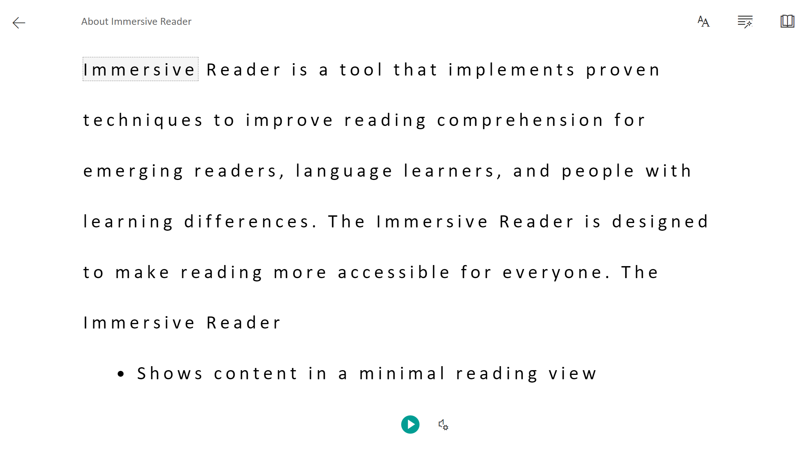

## Introduction

The Azure Immersive Reader is a helpful resource that allows you to embed an accessible text reader with features like reading aloud, translating languages, focusing attention through highlighting, etc. More documentation can be found [here](https://docs.microsoft.com/en-us/azure/applied-ai-services/immersive-reader/).

## How to create the resources

Creating the Azure Immersive Reader requires the configuration of Azure Active Directory permissions. This is because the Immersive Reader only works with Azure AD permissions (it does not support authentication with connection strings, managed identities, or access tokens).

The steps to create the Immersive Reader resource and configure the Azure AD authentication are documented [on the Microsoft Docs](https://docs.microsoft.com/en-us/azure/applied-ai-services/immersive-reader/how-to-create-immersive-reader). However, I encountered issues when running the PowerShell script due to breaking changes in the APIs. Therefore, I researched how to create the Immersive Reader resources manually through the Azure Portal and am documenting it here to help make it easier to create the resources.  

## Prerequisites

* An Azure account with the necessary permissions as documented here https://docs.microsoft.com/en-us/azure/active-directory/develop/howto-create-service-principal-portal
* A resource group in which you will create the resources

## Getting Started

1. In the Azure Portal, create a `Immersive Reader` resource by searching for Immersive Reader.     
    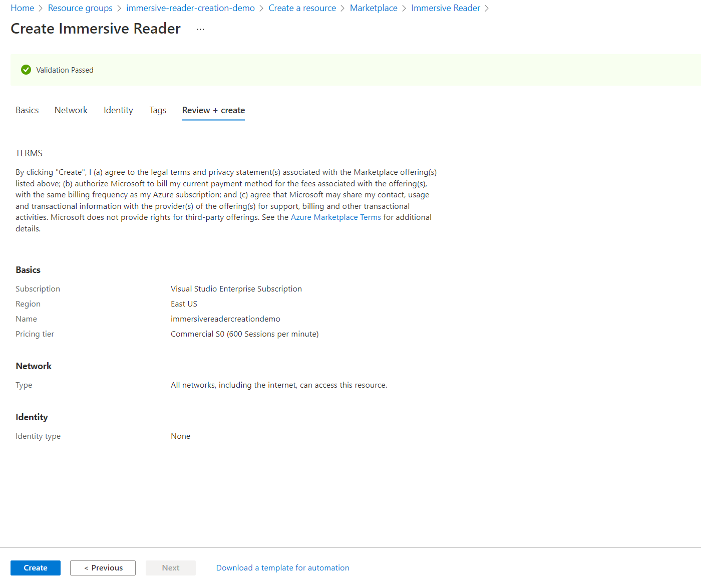

2. Navigate to `Azure Active Directory` by searching for `Azure Active Directory`. 
    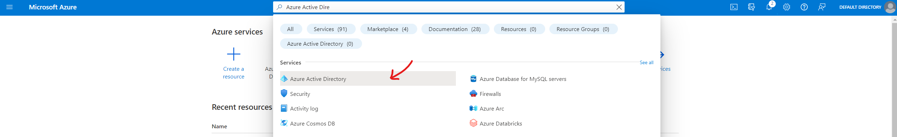

3. Navigate to `App Registrations`
    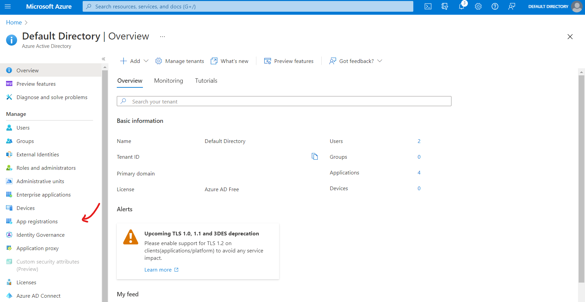

4. Create new registration
    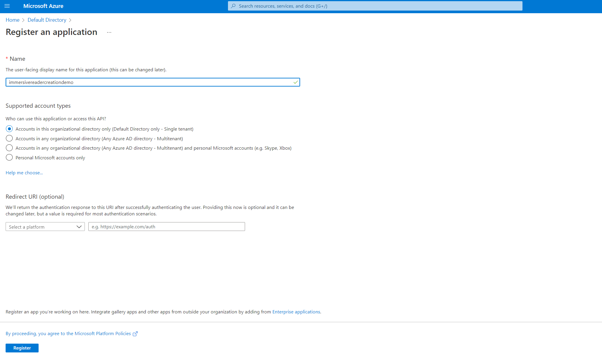

5. Take note of the **Application (client) ID** and the **Directory (tenant) ID** (hidden here for security purposes)
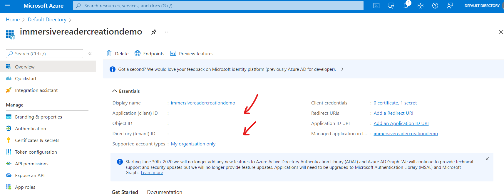

6. Navigate to `Certificates & secrets` witin the app registration
    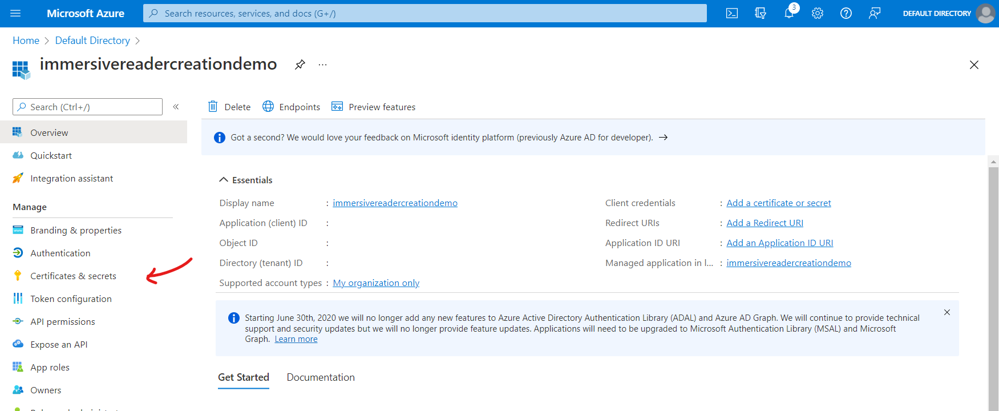

7. Create new client secret
    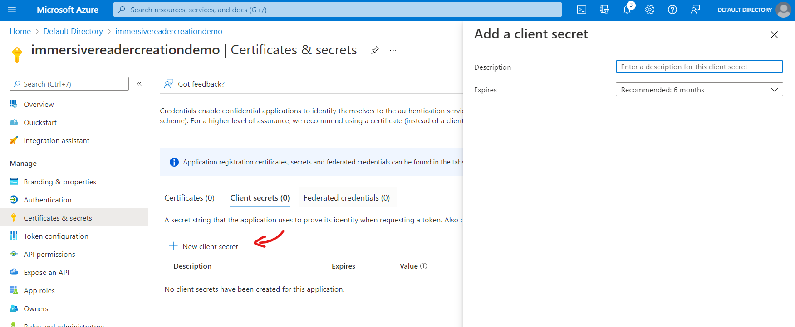

8. Note the **secret value** (you can only copy it upon creation, so store it well)
    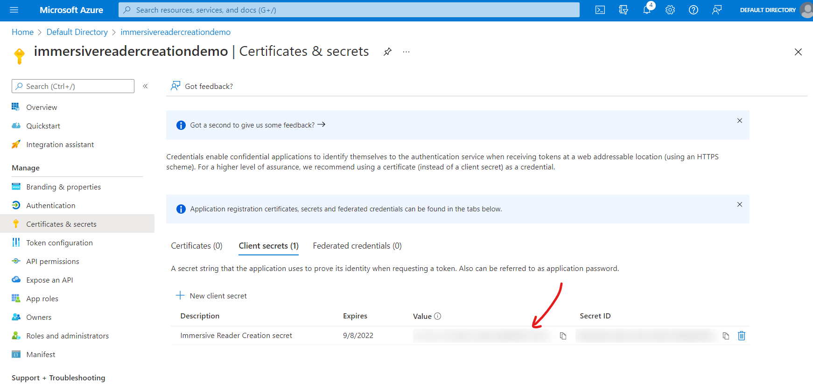

9. Return to the Immersive Reader resource and note the **subdomain of your endpoint**
    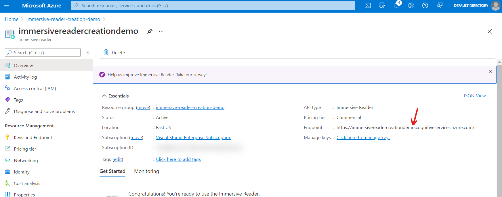 

10. Go to the `Access control (IAM)` of the Immersive Reader resource
    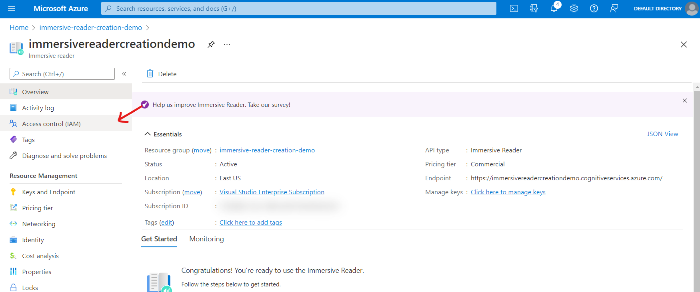

11. Add role assignment
    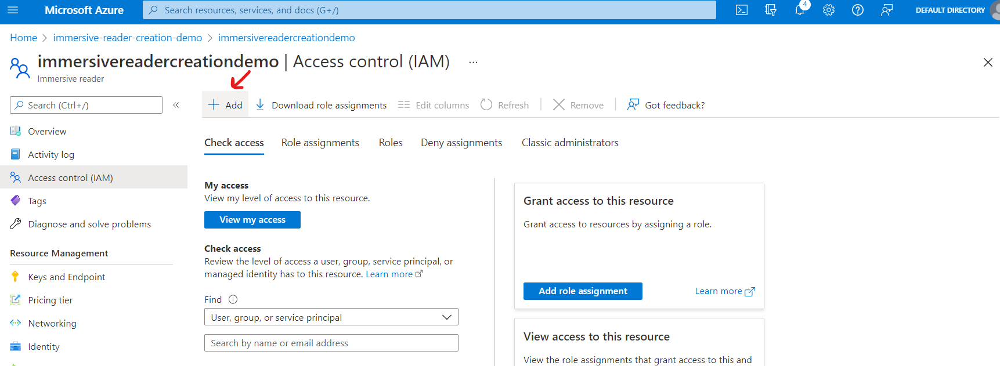

12. Select `Cognitive Services Immersive Reader User`
    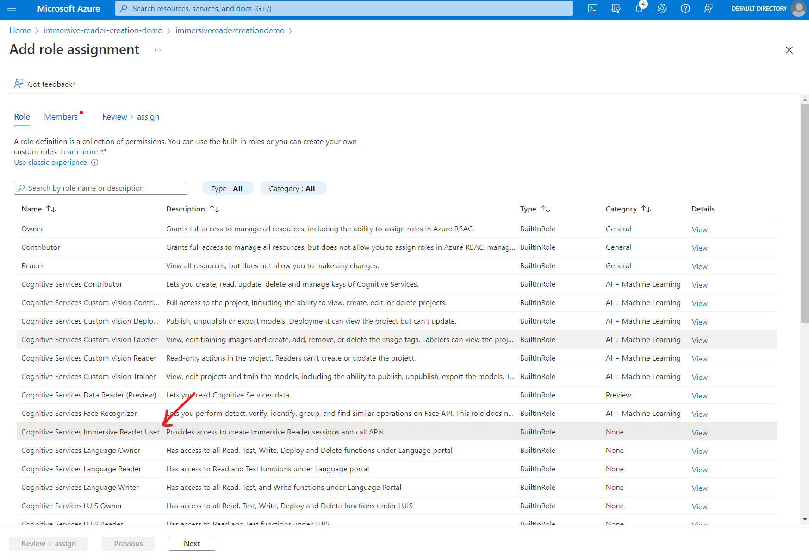

13. Assign access to the Azure AD app registration you created previously
    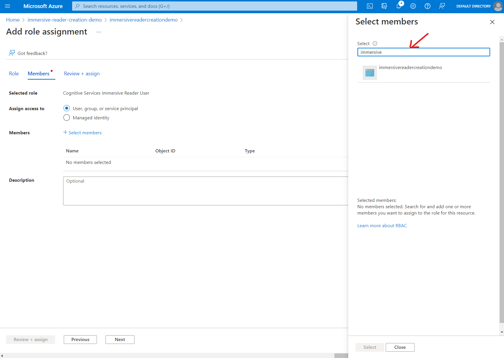

14. Review & assign

15. You may now use the Immersive Reader resources as documented in the [quickstart guides](https://docs.microsoft.com/en-us/azure/applied-ai-services/immersive-reader/quickstarts/client-libraries?pivots=programming-language-nodejs). You have taken note of the tenant id (in step 5), the client id (in step 5), the client secret (in step 8), the subdomain (in step 9). You will need these to use the Immersive Reader SDK.
